<div align="center">



<br/>

<a href="https://www.linkedin.com/in/umer-yasir">
  
</a>
<a href="mailto:umeryasir@gmail.com">
  
</a>
<a href="https://github.com/umer-yasir">
  
</a>
<a href="https://www.facebook.com/umer.yasir.927">
  
</a>

</div>

<br/>

## 👋 About Me

I'm a **Full Stack Software Engineer** focused on building scalable, maintainable, and production-ready web applications.

I work across the entire development lifecycle — from designing responsive frontends to building backend APIs, database architecture, integrations, and deployment.

I enjoy solving complex engineering problems, improving application performance, and turning ideas into reliable software.

```yaml
role: Full Stack Software Engineer
specialization:
  - React.js
  - Next.js
  - Spring Boot
  - Node.js
databases:
  - MySQL
  - MariaDB
  - MongoDB
cloud:
  - AWS
  - S3
  - EC2
philosophy: "Simple, maintainable, production-ready"
```

---

## 🧩 Tech Stack

<div align="center">

### Languages


<br/><br/>

### Frontend


<br/><br/>

### Backend


<br/><br/>

### Database & Cloud


<br/><br/>

### Tools


</div>

---

## 🚀 What I Build

<table>
<tr>
<td width="50%" valign="top">

### 🌐 Web Applications

* Responsive React & Next.js applications
* Admin dashboards
* Business portals
* Real-time applications
* REST API integrations

</td>

<td width="50%" valign="top">

### ⚙️ Backend Systems

* Spring Boot APIs
* Node.js & Express services
* Database architecture
* Authentication & authorization
* Background jobs & automation

</td>
</tr>

<tr>
<td width="50%" valign="top">

### ☁️ Cloud & Deployment

* AWS EC2
* Amazon S3
* Server configuration
* Nginx
* PM2
* Docker

</td>

<td width="50%" valign="top">

### 📊 Engineering

* Performance optimization
* Scalable architecture
* Database optimization
* Third-party integrations
* Production troubleshooting

</td>
</tr>
</table>

---

## 📌 Featured Projects

<div align="center">

<!-- Replace these with your actual repository names -->

<a href="https://github.com/umer-yasir/REPO_NAME">

</a>

<a href="https://github.com/umer-yasir/REPO_NAME_2">

</a>

</div>

---

## 📊 GitHub Activity

<div align="center">


<br/><br/>


</div>

---

## 🔥 Contribution Streak

<div align="center">


</div>

---

## 🏆 GitHub Trophies

<div align="center">


</div>

---

## 🐍 Contribution Snake

<div align="center">


</div>

---

<div align="center">

### 💡 "Building clean, scalable, production-ready software."

<br/>


<br/><br/>


</div>
